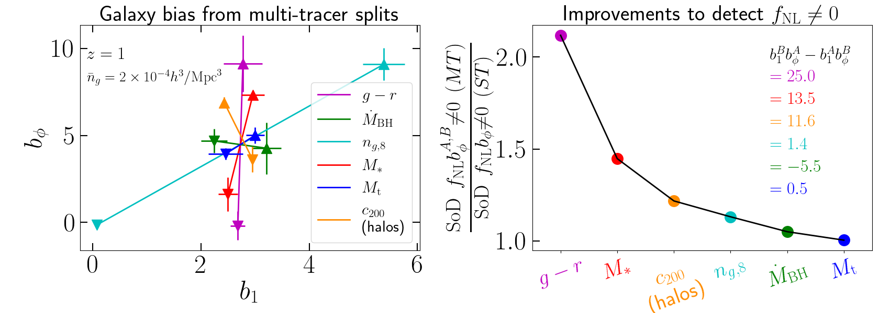

# Improving $f_{\rm NL}$ measurements with galaxy multi-tracer analyses

This code does part of the numerical analyses in the paper:

- Barreira & Krause 2023, https://arxiv.org/abs/2302.09066

In particular, it computes the improvements in observational constraints of the local primordial non-Gaussianity parameter $f_{\rm NL}$ using galaxy multi-tracer analyses. It is useful to identify which types of galaxy selection cuts yield optimal measurements of $f_{\rm NL}$.

The galaxy data, in the form of the galaxy bias parameters $b_1$ and $b_\phi$, comes from separate universe simulations of the IllustrisTNG galaxy formation model. These data is available in the folder *data_simulations_bias* for:

- Redshifts, $z = 0, 0.5, 1, 2, 3$
- Number densities, $\bar{n}_g = (1, 2, 5) \times 10^{-4}\ h^3/{\rm Mpc^3}$

#### Dependencies

- python (numpy, scipy, matplotlib)

#### Code overview

- *commons.py* defines global parameter and functions. It is imported by the other scripts
  
- *plot_paper_fisher_analysis_circle_opposite.py* executes a simple example-analysis to identify which directions in $b_\phi - b_1$ plane give the best $f_{\rm NL}$ improvements in multi-tracer analyses.

- *plot_paper_fisher_sod_analysis_simulations.py*  executes a significance of detection analyses to identify which types of multi-tracer splits in the IllustrisTNG model are optimal for $f_{\rm NL}$ measurements.

#### Gallery

Illustration of the directions in $b_\phi - b_1$ that give the best improvements in multi-tracer analyses. The answer: multi-tracer splits in which the $b_\phi$ and $b_1$ values vary inversely proportional to each other.

Illustration of the improvements to detect $f_{\rm NL}b_\phi \neq 0$ from different multi-tracer splits in IllustrisTNG.

